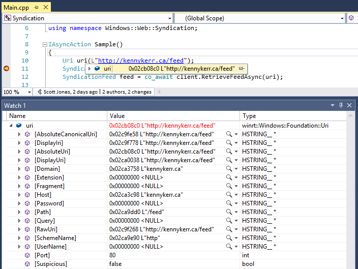

This release of C++/WinRT contains experimental support for Visual Studio native debug visualization (natvis), via the cppwinrt.natvis script.

## Installing

You can manually install cppwinrt.natvis by simply copying it to your per-machine or per-user Visualizers folder.

### Per-Machine
    %VSINSTALLDIR%\Common7\Packages\Debugger\Visualizers\

### Per-User
(you may have to create this folder first)

    %USERPROFILE%\My Documents\Visual Studio 2017\Visualizers

To make it easier to update, you might consider creating a symbolic link from a Visualizers folder to your cppwinrt repo:

    mklink "%USERPROFILE%\My Documents\Visual Studio 2017\Visualizers\cppwinrt.natvis" c:\cppwinrt\10.0.15063.0\winrt\cppwinrt.natvis 

## Visualizing

To see the debug visualization support in action:
* Open the Syndication sample (\cppwinrt\10.0.15063.0\Samples\Syndication)
* Set a breakpoint after the construction of the uri variable
* Build and debug
* When the breakpoint hits, add the uri variable to the watch window, expand it, and refresh its top node.  The uri's property values should be displayed in the debugger.  
* You can also simply mouse over the uri variable, and click the refresh button in the tooltip to see the default visualization value, supplied via the uri's IStringable::ToString() method.



## Limitations
Note that this support is experimental and currently has some limitations.  For example, visualization is not supported for nested objects.  In addition, visualization requires a debugger call back into your application code to retrieve property values (the reason for the explicit refresh).  This is accomplished with a small stub, ```WINRT_get_val```, defined by the C++/WinRT library.  Inclusion of this stub is automatic for debug builds.  It can be opted into for release builds, by defining the symbol ```WINRT_NATVIS```.  We hope to remove these limitations in a future release.

## Troubleshooting
If you have no success visualizing your C++/WinRT variable, you can try troubleshooting by enabling verbose natvis output via: 

    Tools / Options / Debugging / Output Window / Natvis diagnostic messages (C++ only)

When you restart the debugging session, the Debug Output pane should display entries like this:

    Natvis: Parsing natvis xml file: C:\...\cppwinrt.natvis.
    Natvis: C:\...\cppwinrt.natvis(6890,21): Successfully parsed expression 'WINRT_get_val(this,L"{96369F54-8EB6-48F0-ABCE-C1B211E627C3}",0).s' in type context 'winrt::Windows::Foundation::Uri'.

If errors are displayed, please log an issue.

