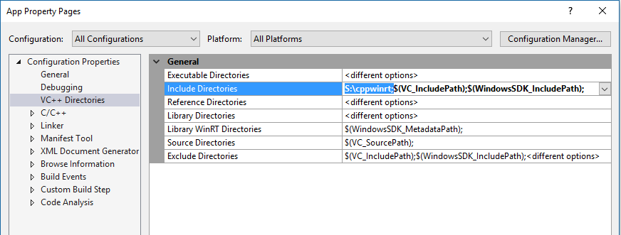
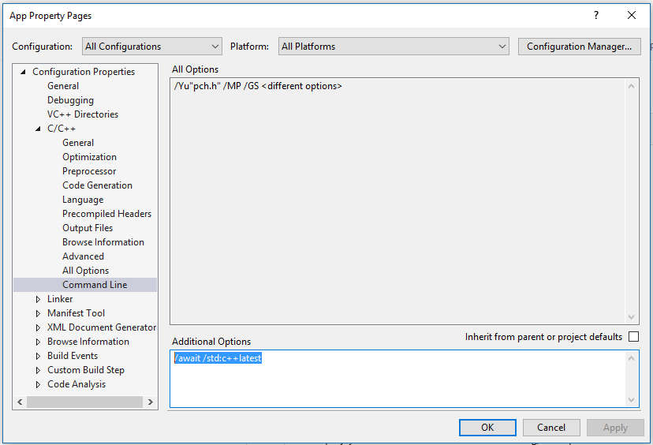
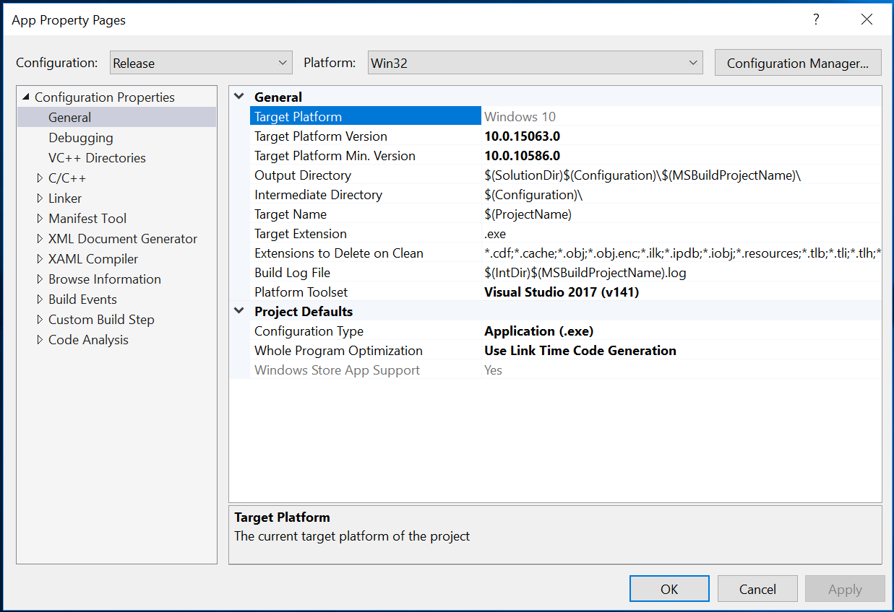

Install the C++/WinRT header files
===============================================

First, you need to copy the C++/WinRT header files to your local system. Download the headers.
Unzip and copy the header files to the desired location on your system. Typically, you
will either:

-   install them to a shared location, or

-   copy them into the project that you are building

We recommend installing them to a shared location to minimize space.

In the following examples, we have downloaded the header files and
copied them into the S:\\cppwinrt folder.

Referencing the headers from a shared location
==============================================

When you install the C++/WinRT header files to a shared location, you
must point your C++ compiler to that location so it can find the header
files.

For Microsoft Visual Studio projects, you can open the Project's
Properties and go to Configuration Properties – VC++ Directories and add
the path to the shared location to the Include Directories path, as
shown.



Next, you include the appropriate header file in your source file(s).

Note that, by design, all the C++/WinRT header files are in the 'winrt'
sub-folder of a folder listed in the Include Directories path.
Therefore, your include statements should look like this:

```C++
  #include "winrt/Windows.Foundation.h"
  #include "winrt/Windows.Storage.Streams.h"
  . . .
  #include "winrt/Windows.Graphics.Imaging.h"
```

For efficiency and best compilation performance, we recommend that you
place these include statements in your pre-compiled header file if you
are using one.

> Tip: Add the parent of the 'winrt' folder to the Include Directories
> path. Do not specify the 'winrt' folder itself in the path.
>
> The Windows SDK contains header files with the same name as a
> C++/WinRT header file. E.g. both have a Windows.Foundation.h file.
> Further, the SDK adds the folder containing these files to the Include
> Directories path.
>
> Therefore, if you set the Include Directories path to
> S:\\cppwinrt\\winrt and simply \#include "Windows.Foundation.h", the
> compiler reads the first such file that it encounters while traversing
> the Include Directories path. This means that you will either pull in
> the SDK header file or the C++/WinRT header file depending on the
> relative positions of the containing folder in the path. Additionally,
> this means that you cannot include both header files, when desired.
>
> Therefore, we deliberately add the 'winrt' parent folder to the
> Include Directories path. This allows you to deterministically
> identify the actual header file you want to include. When you
> \#include "Windows.Foundation.h", you get the Windows SDK header file.
> When you \#include "winrt/Windows.Foundation.h", you get the C++/WinRT
> header file. This also allows you to include both files, if desired.

Using the Visual Studio Update 3 C++ compiler
=============================================

You need the C++ compiler from Visual Studio 2015 Update 3 or later to
compile the C++/WinRT header files. You can determine the version of VS
by going to Help – About Visual Studio.


Enabling the latest C++ standard language features
==================================================

The C++/WinRT library uses a number of the latest C++ standard language 
features. By default, some of those features are not enabled in the Visual 
Studio 2015 C++ compiler. You enable them by specifying the
/await and /std:c++latest as additional command line options.



Use the Windows 10 Anniversary Update SDK
=========================================

The C++/WinRT library requires at least version 10.0.14393.0 (Windows 10
Anniversary Update) of the Windows 10 SDK. To set this in Visual Studio,
open the **Project Settings**, and set the **Target Platform Min.
Version** to at least 10.0.14393.0.



If you are not working in Visual Studio, set the **MinVersion** and
**MaxTestedVersion** to the appropriate values in your app manifest.

```XML
  <Dependencies>
    <TargetDeviceFamily Name="Windows.Universal" MinVersion="10.0.14393.0" MaxVersionTested="10.0.14393.0" />
  </Dependencies>
```
Read the docs!
==============

To learn how to use the C++/WinRT library, browse the [Docs] (./Docs) folder for topics of interest.

The [Header File Design] (./Docs/Header File Design.md) document contains a great discussion of the architecture of and best practices for using the C++/WinRT header files.

For a discussion of the naming conventions used in the C++/WinRT library, read [Naming Conventions] (./Docs/Naming Conventions.md).

Unlike C++/CX, with C++/WinRT you typically pass and receive familar C++ data types when calling WinRT APIs. More information is in [Using Standard C++ types with C++ WinRT] (./Docs/Using Standard C++ types with C++ WinRT.md).

For information about how to migrate existing C++/CX code to C++/WinRT, read [Migrating C++ CX source code to C++ WinRT] (./Docs/Migrating C++ CX source code to C++ WinRT.md).

When you need to write code that works directly with COM and WinRT interfaces, you'll find the necessary infromation in [Interoperability Helper Functions] (./Docs/Interoperability Helper Functions.md).
